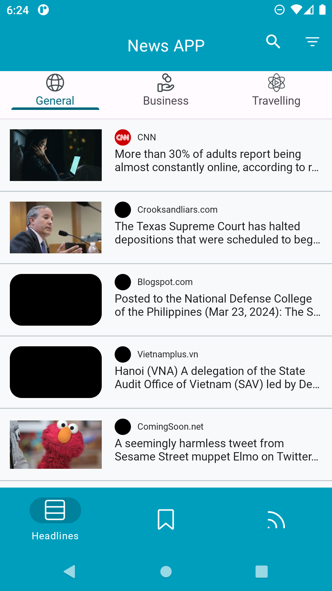
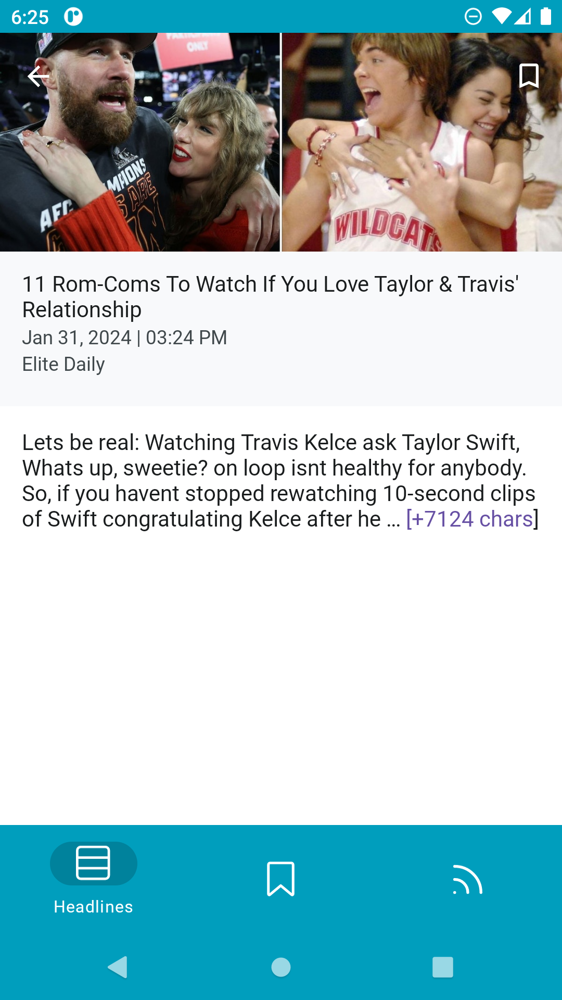
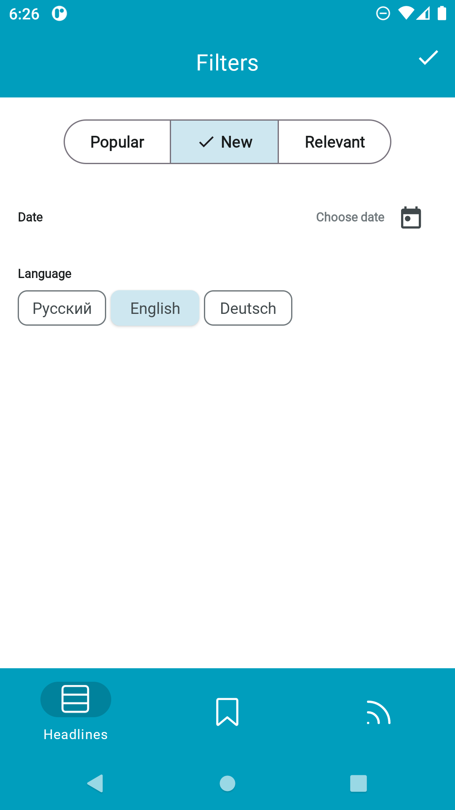
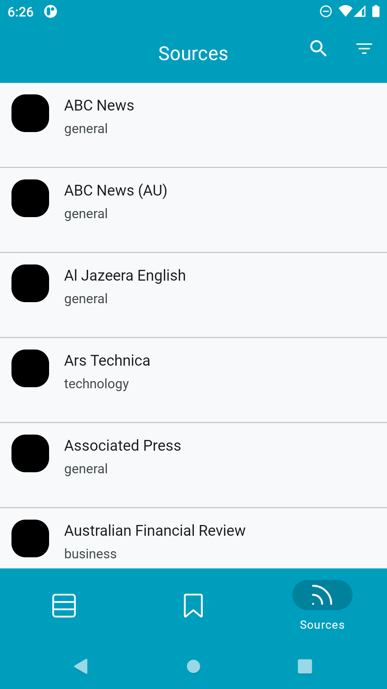

# NewsApp

News Viewing Application for Android

Written in Kotlin

Uses libraries: Dagger2, Retrofit, RxJava, Coroutines, Room, mvp.moxy, Glide, swiperefreshlayout, orbit-mvi, Lottie

Implemented approaches: Clean Architecture, MVP, MVVM

***

Приложение для просмотра Новостей для android
  
Написано на Kotlin
  
Использует библиотеки : Dagger2, Retrofit, RxJava, Coroutines, Room, mvp.moxy, glide, swiperefreshlayout, orbit-mvi, lottie  
  
При напсании реализованы подходы clean, mvp, mvvm

